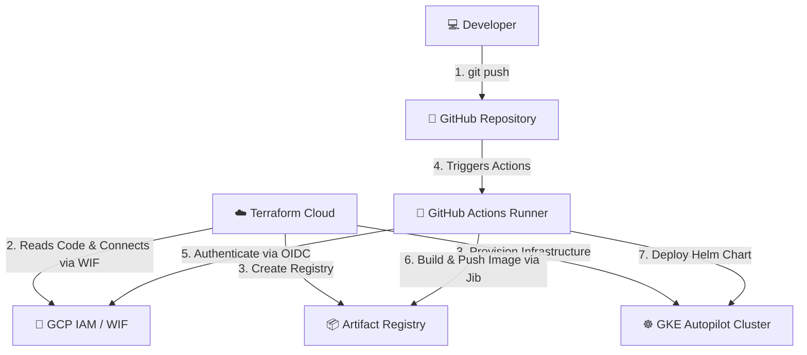

# End-to-End GitOps & Cloud Architecture Guide

यह गाइड आपकी जावा स्प्रिंग बूट एप्लीकेशन के पूरे आर्किटेक्चर, इंफ्रास्ट्रक्चर प्रोविज़निंग (Terraform), CI/CD पाइपलाइन (GitHub Actions) और ऑथेंटिकेशन फ्लो (OIDC WIF) को विस्तार से समझाने के लिए तैयार की गई है। 

---

## 🗺️ 1. आर्किटेक्चर मैप (Architecture Flow)

नीचे दिया गया चित्र दिखाता है कि कैसे कोड डेवलपर से शुरू होकर लाइव क्लाउड (GKE) पर जाता है:



---

## 🔄 2. स्टेप-बाय-स्टेप लाइफसाइकिल (How it Works)

### **स्टेज 1: डेवलपर एक्शन (Developer Push)**
1. डेवलपर लोकल मशीन पर जावा स्प्रिंग बूट कोड या इंफ्रास्ट्रक्चर (Terraform) कोड में बदलाव करता है।
2. डेवलपर `git push origin main` कमांड चलाता है।
3. कोड GitHub Repository पर पुश हो जाता है।

### **स्टेज 2: इंफ्रास्ट्रक्चर सेटअप (Terraform Cloud)**
1. Terraform Cloud आपके GitHub Repository से सीधे कनेक्टेड है। जैसे ही नया इंफ्रास्ट्रक्चर कोड आता है, यह नया रन (Run) शुरू करता है।
2. **ऑथेंटिकेशन (WIF):** Terraform Cloud गूगल क्लाउड से चाबी के बिना (Keyless) बात करने के लिए **Workload Identity Pool (`tfc-pool`)** का उपयोग करता है।
3. **लागू करना (Apply):** यह तीन मुख्य चीज़ें बनाता है:
    *   **GKE Autopilot Cluster (`java-gke-cluster`)**: जहाँ हमारी ऐप चलेगी।
    *   **Artifact Registry (`java-app-repo`)**: जहाँ ऐप का कंटेनर इमेज स्टोर होगा।
    *   **GitHub WIF Configuration**: यह GitHub को जीसीपी में आने की परमिशन देता है।

### **स्टेज 3: CI/CD पाइपलाइन (GitHub Actions)**
जैसे ही कोड पुश होता है, GitHub Actions में वर्कफ़्लो [`.github/workflows/deploy.yml`](file:///C:/Users/AjitP/.gemini/antigravity/scratch/java-gke-cicd/.github/workflows/deploy.yml) चलता है:
1. **सेटअप:** Java 17 इंस्टॉल होता है और कोड चेकआउट होता है।
2. **लॉगिन (OIDC Auth):** यह `google-github-actions/auth` एक्शन का उपयोग करके GCP में लॉगिन करता है (बिना किसी पासवर्ड के)।
3. **बिल्ड और पुश (Jib):** Gradle Jib प्लगइन आपकी ऐप को बिना Docker डेमन (Dockerless build) के सीधा इमेज में कंपाइल करता है और इसे Google Artifact Registry में पुश कर देता है।
4. **क्रेडेंशियल्स फेच:** यह रनटाइम पर GKE क्लस्टर से कनेक्ट होने की अनुमति लेता है।
5. **Helm डिप्लॉय:** Helm चार्ट के ज़रिए वह नया इमेज टैग लेकर पुराने एप्लिकेशन को नए से अपग्रेड कर देता है।

---

## 🔑 3. सीक्रेट्स और ऑथेंटिकेशन आर्किटेक्चर (Secrets & Security)

हमने कोई भी पासवर्ड या की (Key/File) हार्डकोड नहीं की है। सुरक्षा की तीन परते हैं:

### **परत A: GitHub Secrets (लॉगिन चाबी)**
GitHub Repository के "Actions Secrets" in we only stored connectivity credentials:
*   `WIF_PROVIDER`: जीसीपी का वह गेट जहाँ से अनुमति मिलती है (`projects/883954050975/.../github-provider`)।
*   `WIF_SERVICE_ACCOUNT`: वह सर्विस अकाउंट जिसे जीसीपी पर रिसोर्स एक्सेस की पावर मिली है (`github-actions-deployer@...`)।
*   `GCP_PROJECT_ID`: आपका जीसीपी प्रोजेक्ट आईडी।

### **परत B: Workload Identity Federation (सुरक्षित कनेक्शन)**
*   जब GitHub Actions चलता है, तो GitHub जीसीपी को एक **OIDC Token (JWT)** भेजता है।
*   जीसीपी का Workload Identity Pool चेक करता है: **"क्या यह टोकन उसी रिपॉजिटरी से आ रहा है जो wif.tf में सेट है?"** (`assertion.repository == amitpandey1992/java-gke-cicd`).
*   मैच होने पर, जीसीपी उस रनर को कुछ मिनटों के लिए `github-actions-deployer` सर्विस अकाउंट बनने की अस्थायी अनुमति देता है।

### **परत C: GCP IAM Roles (परमिशन की सीमा)**
उस सर्विस अकाउंट के पास केवल वही परमिशन हैं जो हमने [`wif.tf`](file:///C:/Users/AjitP/.gemini/antigravity/scratch/java-gke-cicd/terraform/wif.tf) में दी हैं:
1.  **`roles/artifactregistry.writer`**: सिर्फ इमेज अपलोड करने के लिए।
2.  **`roles/container.developer`**: सिर्फ GKE क्लस्टर में बदलाव करने के लिए।
3.  **`roles/artifactregistry.reader`**: डिफ़ॉल्ट नोड्स के लिए इमेज डाउनलोड करने के लिए।

---

## 🔍 4. कोड और घटकों का विश्लेषण (Code Breakdown)

### **A. जावा स्प्रिंग बूट & Jib ([`build.gradle`](file:///C:/Users/AjitP/.gemini/antigravity/scratch/java-gke-cicd/build.gradle))**
Jib प्लगइन स्प्रिंग बूट कोड को एक ऑप्टिमाइज्ड कंटेनर इमेज में बदलने का काम करता है।
```gradle
jib {
    from {
        image = 'eclipse-temurin:17-jre-alpine' // लाइटवेट बेस इमेज
    }
    container {
        ports = ['8080'] // ऐप का इंटरनल पोर्ट
    }
}
```

### **B. Kubernetes Helm चार्ट ([`deployment.yaml`](file:///C:/Users/AjitP/.gemini/antigravity/scratch/java-gke-cicd/helm/java-app/templates/deployment.yaml))**
चार्ट तय करता है कि ऐप कैसे रन करेगी:
*   `replicas`: 2 (ताकि अगर एक नोड क्रैश हो, तो दूसरा ट्रैफिक संभाल सके - High Availability)।
*   `ports`: `8080` पर कंटेनर चलता है और `LoadBalancer` सर्विस इसे बाहरी दुनिया के लिए पोर्ट `80` पर एक्सपोज़ करती है।
*   `Liveness & Readiness Probes`: स्प्रिंग बूट एक्चुएटर `/actuator/health` का उपयोग करके GKE लगातार चेक करता है कि कंटेनर सही से काम कर रहा है या नहीं।

---

## 📈 5. सुधार और अगले चरण (Enhancements for Next Phase)

अगले फेज़ में हम इन बेहतरीन फ़ीचर्स को जोड़कर अपने आर्किटेक्चर को और ज़्यादा इंडस्ट्रियल-ग्रेड (Production-ready) बना सकते हैं:

### **1. Google Secret Manager इंटीग्रेशन (Application Secrets)**
*   **अभी:** स्प्रिंग बूट की कुछ सेटिंग्स प्रोफाइल फाइलों में हो सकती हैं।
*   **अगला फेज़:** हम संवेदनशील जानकारी (जैसे डेटाबेस का पासवर्ड, API कीज़) को **GCP Secret Manager** में रखेंगे। स्प्रिंग बूट ऐप स्टार्टअप के समय WIF का उपयोग करके उन सीक्रेट्स को सीधे फेच कर लेगी।

### **2. Ingress & Google Managed HTTPS (SSL) प्रमाणपत्र**
*   **अभी:** हम सीधे IP एड्रेस `http://35.254.139.193` से कनेक्ट कर रहे हैं (जो कि असुरक्षित HTTP है)।
*   **अगला फेज़:** हम एक **Kubernetes Ingress Route** बनाएंगे, इसे एक डोमेन (जैसे `api.yourdomain.com`) से लिंक करेंगे और गूगल की तरफ से फ़्री **Managed SSL Certificate (HTTPS)** इनेबल करेंगे।

### **3. ऑटो-हॉरिजॉन्टल पॉड स्केलिंग (HPA)**
*   **अभी:** हमेशा 2 पॉड्स चलते हैं।
*   **अगला फेज़:** हम क्लस्टर पर **Horizontal Pod Autoscaler (HPA)** लगा सकते हैं। जब ट्रैफिक (CPU load) बढ़ेगा, तो पॉड्स की संख्या अपने आप 2 से बढ़कर 5 या 10 हो जाएगी, और ट्रैफिक कम होने पर वापस 2 हो जाएगी।

### **4. Terraform VCS Trigger ऑटोमेशन**
*   **अभी:** जब भी आप गिट पुश करते हैं, Terraform Cloud इंफ्रास्ट्रक्चर रन ट्रिगर करता है, भले ही इंफ्रास्ट्रक्चर में कोई बदलाव न हुआ हो।
*   **अगला फेज़:** हम Terraform Cloud में **VCS Triggers** सेट करेंगे कि वह केवल तभी ट्रिगर हो जब `terraform/` फोल्डर की फाइलों में कोई बदलाव पुश किया जाए।

### **5. लॉगिंग और मॉनिटरिंग (Cloud Logging & Monitoring)**
*   **अगला फेज़:** स्प्रिंग बूट के सभी कंसोल लॉग्स को सीधे **GCP Cloud Logging (Stdout)** पर सिंक करेंगे और एरर अलर्ट्स के लिए Slack/Email नोटिफिकेशन सेट करेंगे।
