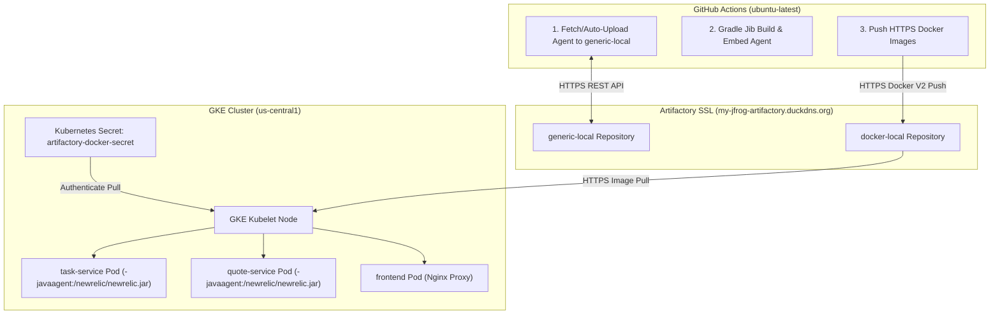

# JFrog Artifactory Integration & Troubleshooting Guide

This document details the issues, root causes, architectural limitations, and step-by-step technical fixes applied during the migration from Google Artifact Registry to a self-hosted **JFrog Artifactory** instance (`my-jfrog-artifactory.duckdns.org`).

---

## 1. Issue Summary Matrix

| Issue ID | Category | Primary Symptom | Root Cause | Fix / Resolution |
|---|---|---|---|---|
| **ISSUE-01** | GKE Kubelet / Runtime | `http: server gave HTTP response to HTTPS client` / `ErrImagePull` | Kubernetes Kubelet strictly enforces HTTPS for image registries. GKE Autopilot forbids custom insecure registry node configs. | Configured DuckDNS domain (`my-jfrog-artifactory.duckdns.org`) with valid SSL/TLS termination. |
| **ISSUE-02** | Docker CLI | `remote error: tls: unrecognized name` during `docker login` | Docker CLI automatically attempts TLS handshake when authenticating to custom IP/port endpoints. | Migrated from plain HTTP IP (`137.23.52.82:8082`) to HTTPS domain. |
| **ISSUE-03** | Gradle Jib | `BuildStepsExecutionException: set sendCredentialsOverHttp to true` | Jib safety mechanism prevents sending HTTP Basic Auth header unencrypted over plain HTTP. | Added `-Djib.sendCredentialsOverHttp=true` and `GRADLE_OPTS` workaround, then removed flags after HTTPS migration. |
| **ISSUE-04** | Artifactory Storage | HTTP 404 when downloading `newrelic.jar` from `generic-local` | The `generic-local` repository was newly created and did not contain `newrelic.jar`. | Added pipeline step: checks Artifactory first, auto-downloads from official site if 404, uploads to `generic-local`, and caches for future builds. |
| **ISSUE-05** | Kubernetes Auth | `ImagePullBackOff` / 401 Unauthorized from Artifactory | GKE nodes could not authenticate to the private `docker-local` repository in Artifactory. | Created Helm template `artifactory-secret.yaml` (`dockerconfigjson`) and injected `imagePullSecrets` in all Deployment manifests. |

---

## 2. Detailed Technical Breakdown & Root Causes

### ISSUE-01: Why GKE Autopilot Failed on HTTP IP Endpoints (`137.23.52.82:8082`)

#### Root Cause:
Kubernetes container runtimes (`containerd` / `dockerd`) enforce HTTPS as a strict security baseline when pulling container images. 
When GKE Kubelet attempts to pull an image such as `137.23.52.82:8082/docker-local/task-service:latest`:
1. Kubelet initiates an HTTPS TLS handshake to `https://137.23.52.82:8082/v2/`.
2. The HTTP server on port 8082 responds with plain HTTP text instead of a TLS certificate.
3. Kubelet aborts image extraction with `http: server gave HTTP response to HTTPS client` or `ErrImagePull`.

#### Why standard Kubernetes workarounds failed:
On standard GKE or self-managed Kubernetes, administrators edit `/etc/containerd/config.toml` or `/etc/docker/daemon.json` on worker nodes to declare `insecure_registries = ["137.23.52.82:8082"]`. However, on **GKE Autopilot**, Google manages worker node configuration and blocks node-level SSH and daemon configuration alterations for security compliance.

#### Applied Solution:
Configured a public domain name `https://my-jfrog-artifactory.duckdns.org/` backed by a valid SSL/TLS certificate. GKE Kubelet now connects over standard, secure HTTPS (Port 443), satisfying all Autopilot node security policies.

---

### ISSUE-02: Docker CLI TLS Handshake Failure

#### Root Cause:
When running `docker login 137.23.52.82:8082 -u admin --password-stdin` inside GitHub Actions runners (`ubuntu-latest`), Docker CLI attempts an HTTPS connection to `https://137.23.52.82:8082/v2/`. Since the IP endpoint had no TLS certificate configured, the handshake failed with `remote error: tls: unrecognized name`.

#### Applied Solution:
Temporarily added a runner configuration step in GitHub Actions:
```bash
sudo mkdir -p /etc/docker
echo '{"insecure-registries": ["137.23.52.82:8082"]}' | sudo tee /etc/docker/daemon.json
sudo systemctl restart docker
```
Following the HTTPS domain setup (`my-jfrog-artifactory.duckdns.org`), this temporary workaround was removed, restoring clean standard Docker CLI commands.

---

### ISSUE-03: Gradle Jib HTTP Credentials Exception

#### Root Cause:
The Gradle Jib plugin (`com.google.cloud.tools.jib`) enforces credential security. If Jib detects an unencrypted HTTP registry connection while credentials (`to.auth.username` / `password`) are provided, it intentionally throws:
`com.google.cloud.tools.jib.plugins.common.BuildStepsExecutionException: Build image failed ... set the 'sendCredentialsOverHttp' system property to true`

#### Applied Solution:
Configured both `task-service/build.gradle` and `quote-service/build.gradle`:
```groovy
jib {
    allowInsecureRegistries = true
}
```
And passed `GRADLE_OPTS="-Djib.sendCredentialsOverHttp=true"` in CI/CD. Once HTTPS (`my-jfrog-artifactory.duckdns.org`) was enabled, `allowInsecureRegistries` flags were removed for clean production code standards.

---

### ISSUE-04: Automated `newrelic.jar` Provisioning to `generic-local`

#### Root Cause:
The Artifactory `generic-local` repository was empty. Hardcoding raw 40MB `.jar` binaries directly in Git bloats repository size and violates enterprise governance.

#### Applied Solution:
Implemented a dynamic fetch/upload fallback step in `.github/workflows/deploy.yml`:
```bash
# Check if newrelic.jar exists in Artifactory generic-local
STATUS_CODE=$(curl -s -o /dev/null -w "%{http_code}" \
  -u "${secrets.ARTIFACTORY_USER}:${secrets.ARTIFACTORY_GENERIC_TOKEN}" \
  "${ARTIFACTORY_URL}/generic-local/newrelic/newrelic.jar")

if [ "$STATUS_CODE" -eq 200 ]; then
  echo "Downloading existing newrelic.jar from Artifactory generic-local..."
  curl -s -u "${secrets.ARTIFACTORY_USER}:${secrets.ARTIFACTORY_GENERIC_TOKEN}" \
    -o task-service/src/main/jib/newrelic/newrelic.jar \
    "${ARTIFACTORY_URL}/generic-local/newrelic/newrelic.jar"
else
  echo "Agent missing in Artifactory. Downloading official agent and uploading to generic-local..."
  curl -s -L -o task-service/src/main/jib/newrelic/newrelic.jar \
    https://download.newrelic.com/newrelic/java-agent/newrelic-agent/current/newrelic.jar
  
  curl -s -u "${secrets.ARTIFACTORY_USER}:${secrets.ARTIFACTORY_GENERIC_TOKEN}" \
    -T task-service/src/main/jib/newrelic/newrelic.jar \
    "${ARTIFACTORY_URL}/generic-local/newrelic/newrelic.jar"
fi
```
Jib then embeds `/newrelic/newrelic.jar` directly into container image layers. GKE pods require **zero runtime downloads** or external network access to run New Relic APM.

---

### ISSUE-05: Private Registry Authentication on GKE (`imagePullSecrets`)

#### Root Cause:
Artifactory requires authentication (`admin` + Docker Token) to pull images from `docker-local`. GKE nodes defaulted to unauthenticated pulls, resulting in HTTP 401 Unauthorized errors.

#### Applied Solution:
1. Created Helm secret template `helm/java-app/templates/artifactory-secret.yaml`:
```yaml
{{- if and .Values.artifactory.enabled .Values.artifactory.dockerConfigJson }}
apiVersion: v1
kind: Secret
metadata:
  name: artifactory-docker-secret
type: kubernetes.io/dockerconfigjson
data:
  .dockerconfigjson: {{ .Values.artifactory.dockerConfigJson }}
{{- end }}
```
2. Added `imagePullSecrets` to `frontend.yaml`, `task-service.yaml`, `quote-service.yaml`:
```yaml
spec:
  imagePullSecrets:
    - name: artifactory-docker-secret
```
3. Dynamically generated `.dockerconfigjson` in GitHub Actions via base64 encoding and passed it to `helm upgrade --install`.

---

## 3. Final Architecture Architecture State



---

## 4. Key Takeaways for Future Reference
1. **Never commit large binaries to Git**: Download dependencies during CI/CD build steps and store them in Artifactory repositories.
2. **Kubernetes Image Registries must use HTTPS**: GKE Autopilot mandates valid SSL/TLS endpoints for custom registries.
3. **Pre-bake APM agents into images**: Baking `newrelic.jar` into image layers via Jib guarantees zero network overhead and zero runtime download failures on restricted Kubernetes clusters.
