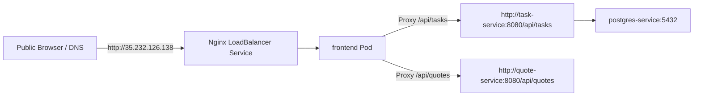

# Permanent DNS Sitemap & System Endpoint Registry

This document serves as the permanent endpoint sitemap for all services, user interfaces, repositories, and cloud resources configured in this project.

---

## 🌐 1. Public Domain & Service Endpoints

| Service / Interface | Public Domain / URL | Protocol | Backend Target / Target IP |
|---|---|---|---|
| **Frontend Web Application** | `http://java-gke-app.duckdns.org` *(or your mapped subdomain)* | HTTP | GCP Static Reserved IP: `35.232.126.138` |
| **Frontend Direct IP Access** | `http://35.232.126.138/` | HTTP | GKE LoadBalancer Service (`frontend:80`) |
| **JFrog Artifactory Console** | `https://my-jfrog-artifactory.duckdns.org/` | HTTPS (SSL) | Self-Hosted VM (`137.23.52.82:8082`) |
| **JFrog Docker Registry** | `my-jfrog-artifactory.duckdns.org/docker-local` | HTTPS Docker V2 | Artifactory `docker-local` Repository |
| **JFrog Generic Repository** | `https://my-jfrog-artifactory.duckdns.org/artifactory/generic-local` | HTTPS REST | `newrelic.jar` Dependency Storage |
| **JFrog Helm Repository** | `https://my-jfrog-artifactory.duckdns.org/artifactory/api/helm/helm-local` | HTTPS Helm V1 | Helm Chart Management |
| **New Relic APM Dashboard** | `https://one.newrelic.com/` | HTTPS (EU Tenant) | Direct Ingest via `JAVA_TOOL_OPTIONS` |

---

## 🔒 2. Internal Cluster Microservice Routing (Nginx Proxies)

Inside the GKE Kubernetes Cluster, traffic is routed internally via Kubernetes DNS:



---

## ☁️ 3. Google Cloud Platform Metadata

- **GCP Project ID**: `project-616fef18-15b8-4d6c-8a2`
- **GKE Cluster Name**: `java-gke-cluster`
- **GCP Region**: `us-central1`
- **Workload Identity Pool**: `github-pool-v5`
- **WIF Provider**: `github-provider`
- **GCP Reserved Static IP Name**: `frontend-static-ip` (`35.232.126.138`)

---

## 🛠️ 4. Quick Verification Commands

```bash
# 1. Verify DNS Resolution for Application
nslookup java-gke-app.duckdns.org

# 2. Check GKE Frontend Load Balancer Service Status
kubectl get svc frontend

# 3. Check All Microservice Pods
kubectl get pods -o wide
```
