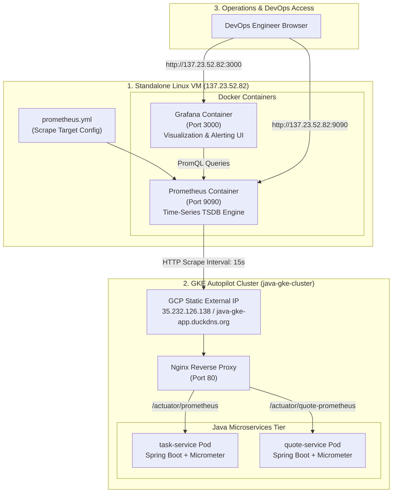
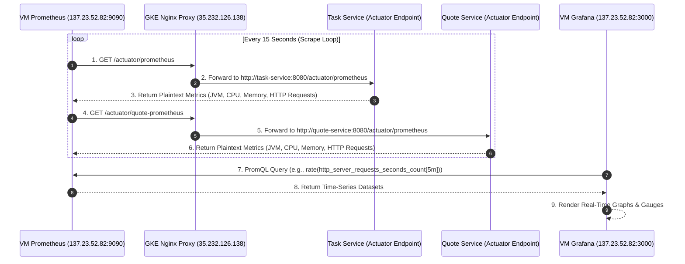

# Prometheus, Grafana & Managed Observability Architecture Guide

This guide provides a comprehensive architecture blueprint for the **Standalone VM Prometheus (`137.23.52.82:9090`) and Grafana (`137.23.52.82:3000`)** integration with GKE workloads, along with an in-depth comparison between **Self-Managed Metrics (Prometheus/Grafana)** and **Cloud Managed Logging (GCP Cloud Logging & Monitoring)**.

---

## 1. Full System Architecture & Data Flow



---

## 2. Metrics Scraping & Exporter Sequence



---

## 3. Metrics vs. Managed Logging (Deep-Dive Comparison)

Observability is built on **Three Pillars**: **Metrics**, **Logs**, and **Traces**. Understanding the structural and operational differences between **Self-Managed Metrics (Prometheus/Grafana)** and **Cloud Managed Logging (GCP Cloud Logging)** is critical for system design.

### Comparison Matrix

| Feature / Metric | **Prometheus + Grafana (Self-Managed VM)** | **GCP Cloud Logging / Cloud Monitoring (Managed)** | **Grafana Loki (Managed Logging)** |
|---|---|---|---|
| **Primary Data Type** | **Numeric Metrics** (Counters, Gauges, Histograms) | **Structured & Unstructured Text Logs** (`stdout`, `stderr`, JSON) | **Log Aggregation** (Indexed by labels, unindexed text) |
| **Use Case** | System health, CPU/RAM usage, API latency rates, alerts. | Debugging specific stack traces, audit logs, error hunting. | Correlating logs with Grafana metrics dashboards. |
| **Storage Overhead** | **Very Low** (Numerical data compressed into time-series TSDB). | **High** (Large volumes of raw text strings per second). | **Medium** (Metadata indexed, text compressed). |
| **Cost Model** | **Fixed Cost** (Only VM hosting cost: $0 to $10/month). | **Pay-Per-GB Ingested** ($0.50 per GB after free tier). | **Storage Dependent** (S3/GCS bucket cost). |
| **Data Retention** | Configurable via `prometheus.yml` (e.g., 30 days). | Default 30 days (Log Bucket retention policy). | Configurable in Loki config. |
| **Vendor Lock-in** | **Zero** (100% Open Source CNCF Standard). | **High** (Tightly bound to GCP APIs and Stackdriver). | **Zero** (Open Source Grafana ecosystem). |
| **Query Language** | **PromQL** (`rate(jvm_memory_used_bytes[5m])`) | **GCP Logging Query Language** (`resource.type="k8s_container"`) | **LogQL** (`{app="task-service"} |= "ERROR"`) |

---

### Detailed Conceptual Breakdown

#### 1. What are Metrics? (Prometheus + Grafana)
* **Definition:** Numerical data aggregated over time.
* **Analogy:** Your car's speedometer, fuel gauge, and engine temperature gauge.
* **Why use it:** Answers *"HOW MUCH?"* and *"WHEN?"* (e.g., Is CPU at 95%? Are error rates spiking right now?).
* **Efficiency:** Storing 1,000 metric data points takes a few kilobytes because it only saves timestamp + number.

#### 2. What are Managed Logs? (GCP Cloud Logging / Grafana Loki)
* **Definition:** Discrete text events generated by your code (`logger.error("Database connection failed for user ID 104")`).
* **Analogy:** The detailed diagnostic report printed by a mechanic after a breakdown.
* **Why use it:** Answers *"WHY?"* (e.g., Which exact line of code threw a `NullPointerException`?).
* **Efficiency:** Text logs consume huge disk space (gigabytes per day) if verbose logging is enabled.

---

## 4. Full Configuration Blueprints

### A. VM `docker-compose.yml` (`137.23.52.82`)
```yaml
version: '3.8'

services:
  prometheus:
    image: prom/prometheus:v2.49.1
    container_name: prometheus
    restart: always
    ports:
      - "9090:9090"
    volumes:
      - ./prometheus.yml:/etc/prometheus/prometheus.yml
      - prometheus_data:/prometheus

  grafana:
    image: grafana/grafana:10.3.1
    container_name: grafana
    restart: always
    ports:
      - "3000:3000"
    environment:
      - GF_SECURITY_ADMIN_PASSWORD=admin
    volumes:
      - grafana_data:/var/lib/grafana

volumes:
  prometheus_data:
  grafana_data:
```

### B. VM `prometheus.yml` Target Config (`137.23.52.82`)
```yaml
global:
  scrape_interval: 15s
  evaluation_interval: 15s

scrape_configs:
  - job_name: 'gke-task-service'
    metrics_path: '/actuator/prometheus'
    static_configs:
      - targets: ['java-gke-app.duckdns.org:80']

  - job_name: 'gke-quote-service'
    metrics_path: '/actuator/quote-prometheus'
    static_configs:
      - targets: ['java-gke-app.duckdns.org:80']
```

---

## 5. Summary Checklist for Operations

1. **Prometheus Target Status:** Verify targets are `UP` at `http://137.23.52.82:9090/targets`.
2. **Grafana Data Source:** Prometheus connected at `http://137.23.52.82:9090`.
3. **Recommended Dashboards:** Import Dashboard ID **`11378`** (JVM Micrometer) or **`4701`** (Spring Boot Statistics).
