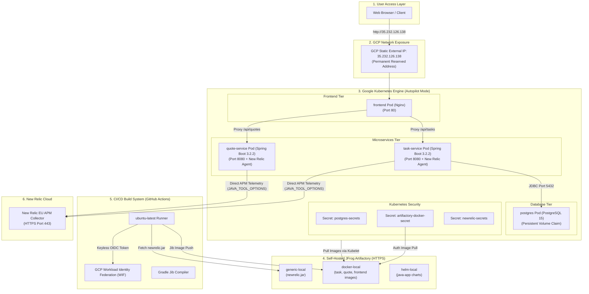
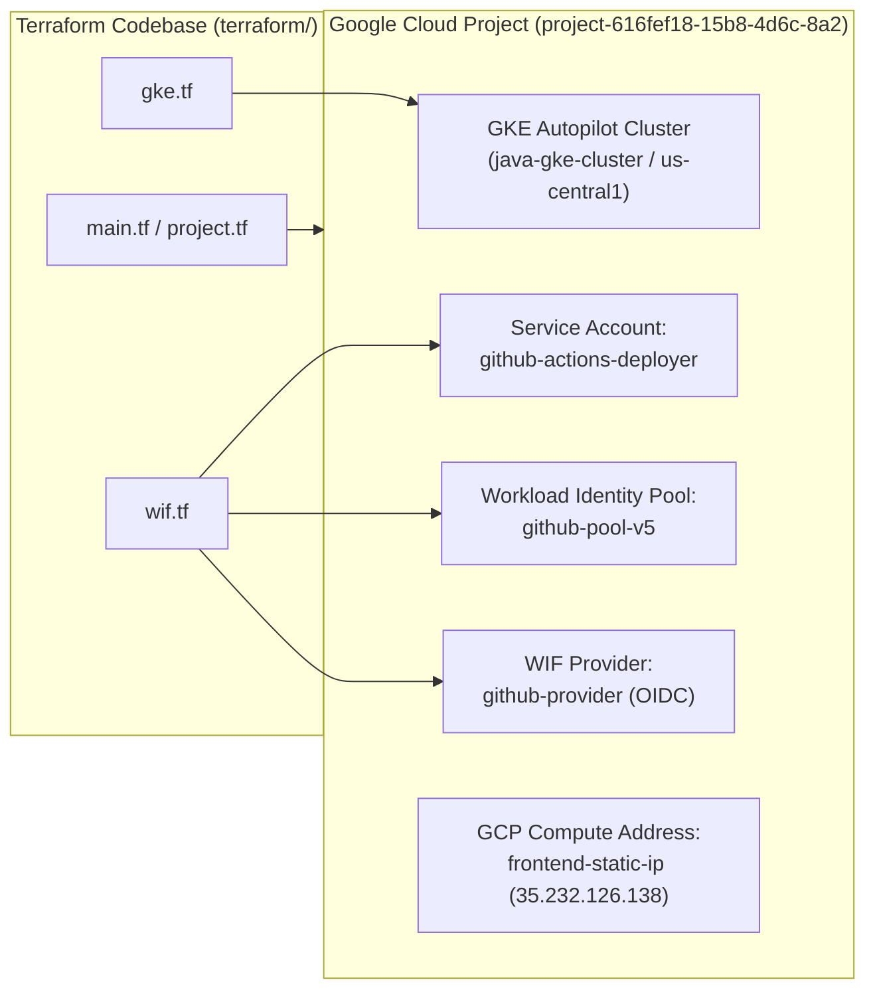
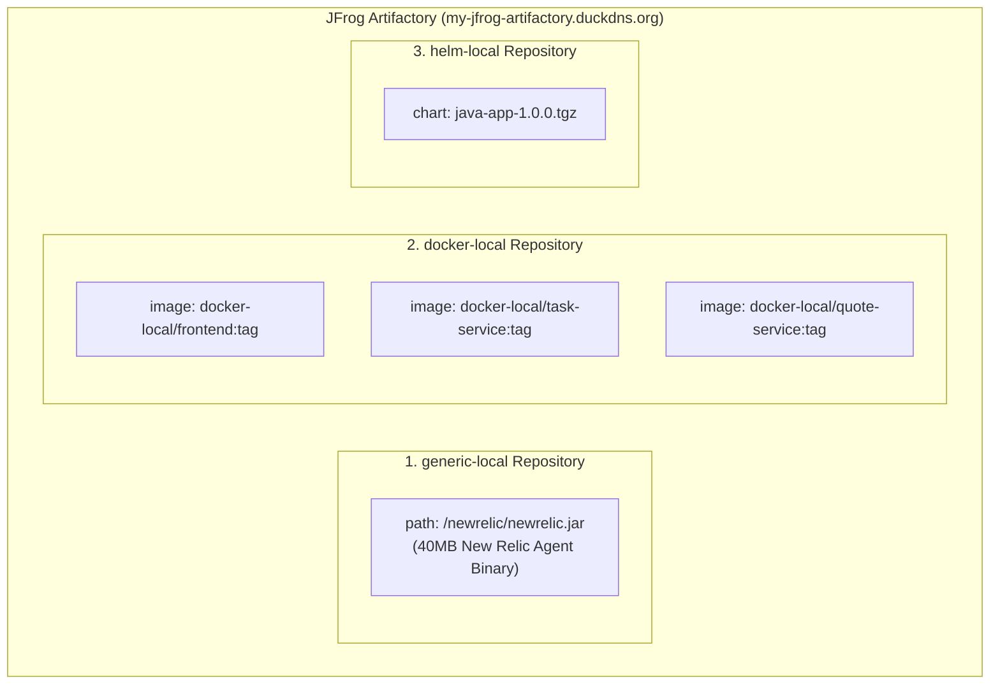
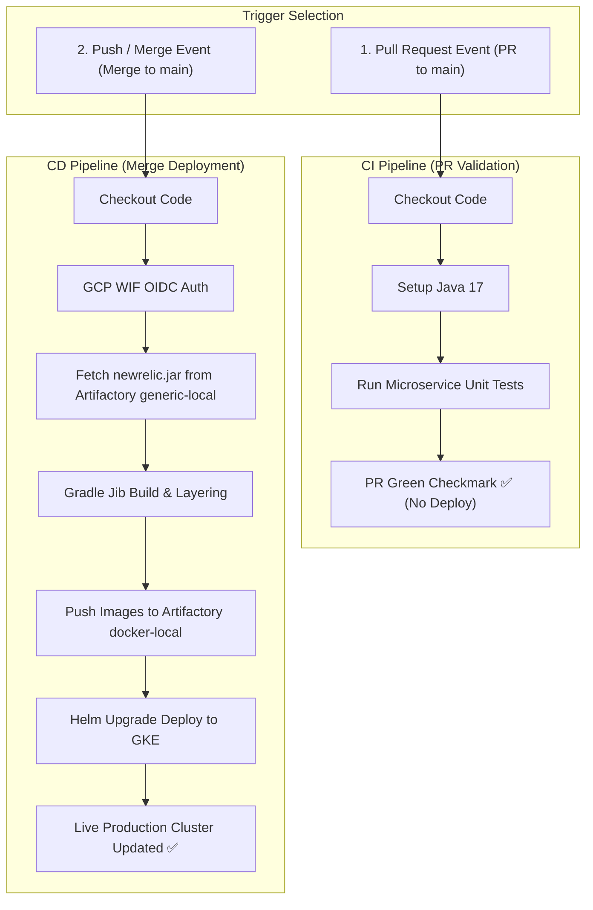
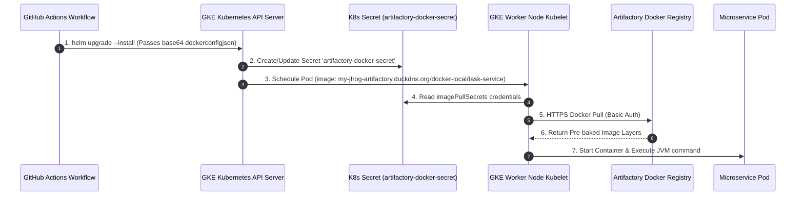
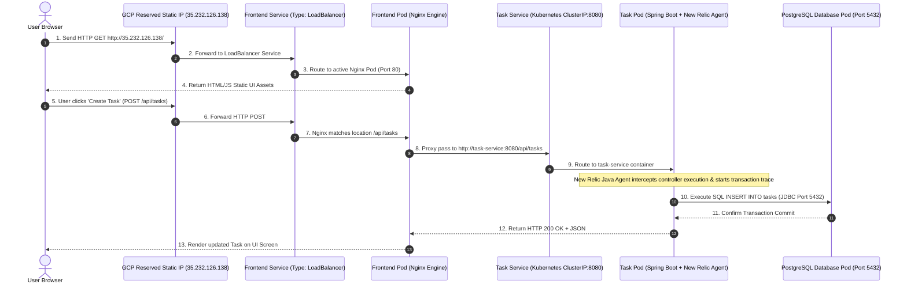
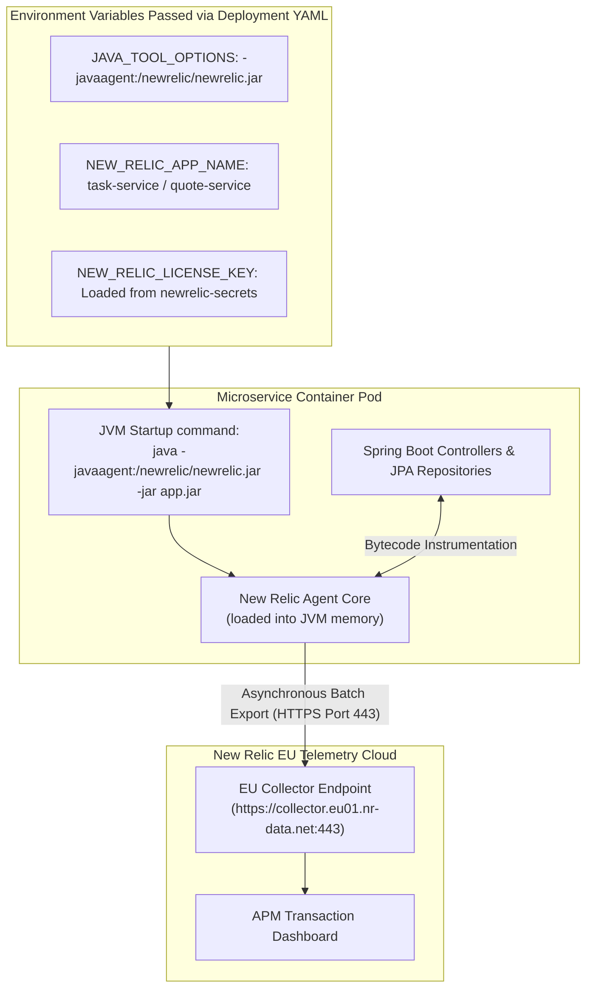

# End-to-End Master System Architecture & Operations Blueprint

This document is the definitive, comprehensive sitemap and architectural blueprint for the **Microservices CI/CD Pipeline, GKE Autopilot Infrastructure, Self-Hosted JFrog Artifactory, and New Relic APM Integration**.

---

## 1. Executive Summary & Master System Architecture

The application is a cloud-native multi-tier system composed of a single-page frontend (Nginx), two Spring Boot microservices (`task-service` and `quote-service`), a PostgreSQL database, a self-hosted JFrog Artifactory repository manager, and New Relic APM telemetry monitoring.

### Master System Architecture Diagram



---

## 2. Tool Matrix & Component Responsibilities

| Tool / Technology | Category | Primary Function & Responsibilities in System |
|---|---|---|
| **Terraform** | Infrastructure as Code (IaC) | Declaratively provisions GKE Autopilot cluster, GCP Service Accounts, Workload Identity Pools, and IAM bindings. |
| **GKE Autopilot** | Managed Kubernetes | Fully managed serverless Kubernetes cluster. Handles node auto-scaling, OS patching, and pod scheduling. |
| **Google Workload Identity Federation (WIF)** | Cloud Security (OIDC) | Enables keyless authentication between GitHub Actions and GCP using short-lived OpenID Connect tokens. |
| **JFrog Artifactory** | Artifact & Docker Registry | Self-hosted HTTPS registry (`my-jfrog-artifactory.duckdns.org`) storing `newrelic.jar` binaries, Docker images, and Helm charts. |
| **Gradle** | Java Build System | Compiles Java 17 source code, manages project dependencies, and runs unit tests for microservices. |
| **Jib (Google Container Tools)** | Container Compiler | Packages Java applications directly into OCI/Docker container images without requiring a Docker daemon or Dockerfiles. |
| **Docker** | Containerization | Builds Nginx frontend images and manages local image layers. |
| **Helm** | Kubernetes Package Manager | Templates, deploys, and upgrades application manifests (`frontend`, `task-service`, `quote-service`, `postgres`, Secrets). |
| **Nginx** | Reverse Proxy / Frontend | Serves static HTML/JS frontend assets and proxies `/api/tasks` and `/api/quotes` traffic to backend Kubernetes services. |
| **Spring Boot 3.2.2** | Application Framework | Powers `task-service` and `quote-service` microservices with embedded Tomcat and REST APIs. |
| **PostgreSQL 15** | Relational Database | Stores persistent task records for `task-service` backed by Kubernetes PersistentVolumeClaims (PVC). |
| **New Relic Java Agent** | Observability (APM) | Bytecode instrumentation agent (`newrelic.jar`) baked into container images to record response times, DB queries, and errors. |

---

## 3. Infrastructure & Provisioning Layer (Terraform & GCP)

### Terraform Provisioning Architecture



### Key Terraform Resources Defined:

1. **GKE Autopilot Cluster ([`terraform/gke.tf`](file:///C:/Users/AjitP/.gemini/antigravity/scratch/java-gke-cicd/terraform/gke.tf))**:
   - `google_container_cluster.primary`: Configured with `enable_autopilot = true` in region `us-central1`. GCP manages node provisioning automatically.
2. **Workload Identity Federation ([`terraform/wif.tf`](file:///C:/Users/AjitP/.gemini/antigravity/scratch/java-gke-cicd/terraform/wif.tf))**:
   - `google_service_account.github_actions_sa`: Creates `github-actions-deployer@project-616fef18-15b8-4d6c-8a2.iam.gserviceaccount.com`.
   - `google_iam_workload_identity_pool.github_pool`: Creates pool `github-pool-v5`.
   - `google_iam_workload_identity_pool_provider.github_provider`: Configured with issuer `https://token.actions.githubusercontent.com` and attribute condition restricting access exclusively to repository `amitpandey1992/java-gke-cicd`.
   - IAM Roles Assigned:
     - `roles/container.developer`: Grants permissions to deploy workloads to GKE.
     - `roles/artifactregistry.writer`: Grants artifact creation rights.
3. **Static Reserved IP (GCP Compute API)**:
   - Reserved via `gcloud compute addresses create frontend-static-ip --region us-central1`.
   - Output IP: `35.232.126.138`.

---

## 4. Self-Hosted JFrog Artifactory Repository Taxonomy

To decouple application builds from external vendor network dependencies and bypass GKE Autopilot outbound runtime limits, all assets are centralized in a self-hosted **JFrog Artifactory** instance accessible over SSL (`https://my-jfrog-artifactory.duckdns.org/`).



---

## 5. CI/CD Build Pipeline & PR-Based Workflow

The deployment workflow ([`.github/workflows/deploy.yml`](file:///C:/Users/AjitP/.gemini/antigravity/scratch/java-gke-cicd/.github/workflows/deploy.yml)) follows an Enterprise **Pull-Request (PR) Driven CI/CD Pattern**:

1. **Pull Request (PR Created / Updated):** Triggers **CI Steps** (Source Checkout, Java 17 Setup, and Gradle Unit Tests). Artifacts are NOT pushed to Artifactory and GKE is NOT updated.
2. **Push / Merge to `main` Branch:** Triggers **CD Steps** (WIF Authentication, New Relic fetching, Jib OCI compilation, Artifactory Docker image push, and Helm GKE deployment).



### How Jib Embeds `newrelic.jar` into Image Layers:
Gradle Jib uses a filesystem convention:
```
Runner Directory Path:                     Container File System Path:
─────────────────────────────────────      ─────────────────────────────────
task-service/src/main/jib/             ──▶  /
  └── newrelic/                        ──▶    └── newrelic/
        └── newrelic.jar               ──▶          └── newrelic.jar  ✅
```
During the `./gradlew jib` execution, Jib copies `src/main/jib/newrelic/newrelic.jar` into **Layer 4** of the OCI container image filesystem at `/newrelic/newrelic.jar`.

---

## 6. Kubernetes Pod Scheduling & Secret Management

### Pod Scheduling & Pull Flow



### Secrets Injected into Kubernetes Namespace:

1. **`artifactory-docker-secret` ([`helm/java-app/templates/artifactory-secret.yaml`](file:///C:/Users/AjitP/.gemini/antigravity/scratch/java-gke-cicd/helm/java-app/templates/artifactory-secret.yaml))**:
   - Type: `kubernetes.io/dockerconfigjson`
   - Purpose: Authorizes GKE Kubelet nodes to pull images from `my-jfrog-artifactory.duckdns.org`.
2. **`postgres-secrets` ([`helm/java-app/templates/postgres.yaml`](file:///C:/Users/AjitP/.gemini/antigravity/scratch/java-gke-cicd/helm/java-app/templates/postgres.yaml))**:
   - Stores `POSTGRES_PASSWORD`.
3. **`newrelic-secrets` ([`helm/java-app/templates/newrelic-secrets.yaml`](file:///C:/Users/AjitP/.gemini/antigravity/scratch/java-gke-cicd/helm/java-app/templates/newrelic-secrets.yaml))**:
   - Stores `license-key` (`NEW_RELIC_LICENSE_KEY`).

---

## 7. Application Topology & End-to-End Request Routing



---

## 8. Observability & Telemetry Architecture (New Relic APM)



---

## 9. Operations & Maintenance Playbook

### A. Cost Optimization (Zero-Cost Shutdown)
To pause billing when taking a break:
```bash
# 1. Connect to GKE cluster
gcloud container clusters get-credentials java-gke-cluster --region us-central1 --project project-616fef18-15b8-4d6c-8a2

# 2. Uninstall Helm workloads (Stops all Pods & deletes Load Balancers)
helm uninstall java-app
```
* **Billing Impact:** Running pods and Load Balancers drop to 0. GKE Autopilot control plane charges $0 when no pods are executing. The Static IP `35.232.126.138` remains reserved.

### B. Resuming Workloads
Push any commit to GitHub, or execute manually:
```bash
helm upgrade --install java-app ./helm/java-app
```
* **Result:** Workloads deploy and automatically bind back to Static IP `35.232.126.138`.

### C. Useful Verification Commands
```bash
# Check Pod status across cluster
kubectl get pods -o wide

# Check External Load Balancer Static IP binding
kubectl get svc frontend

# View real-time application logs
kubectl logs -l app=task-service --tail=100 -f
kubectl logs -l app=quote-service --tail=100 -f

# Check secret creation
kubectl get secrets
```
