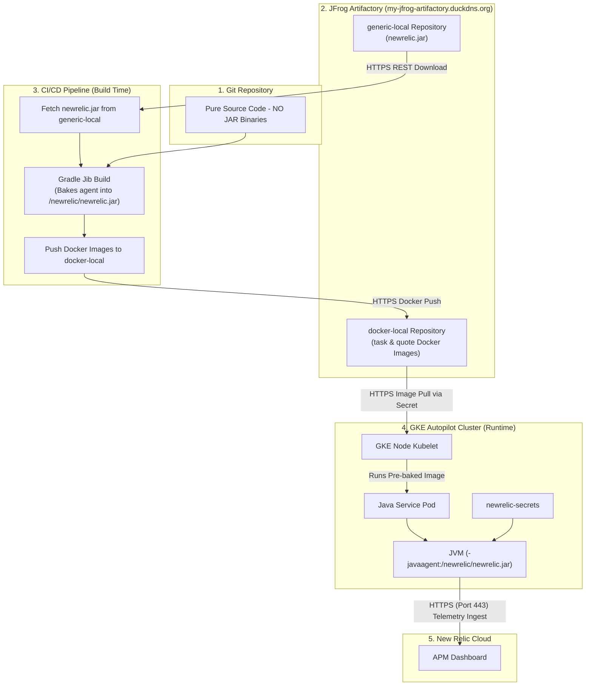

# New Relic Java APM Setup & Architecture Guide (Artifactory Edition)

This guide provides a comprehensive overview of how **New Relic Java APM** monitoring was configured for the Java microservices (`task-service` and `quote-service`) using **JFrog Artifactory** dependency management and **Jib Container Layering**.

---

## 1. Core Concept: What is the Java Agent?

New Relic uses a **Java Agent (`newrelic.jar`)** to monitor JVM-based applications.
* The agent is loaded into the **JVM (Java Virtual Machine)** at startup before application code executes.
* It is activated by passing the JVM argument: `-javaagent:/newrelic/newrelic.jar`.
* As your application handles requests, the agent automatically instruments bytecode to measure performance metrics (API response times, database queries, memory usage, and error rates) and sends telemetry directly to New Relic Cloud.

---

## 2. Approach Evolution

We evaluated 3 distinct approaches to deliver the New Relic Java Agent to GKE workloads:

```
[Approach A: Runtime Download (Failed ❌)] ➔ [Approach B: Commit Jar to Git (Invalid ❌)] ➔ [Approach C: Artifactory + Jib Layering (Success ✅)]
```

### ❌ Approach A: Runtime InitContainer Download (Failed)
* **Implementation:** Used a Kubernetes `initContainer` (`busybox` + `wget`) to download `newrelic.jar` from the internet during pod initialization.
* **Failure Cause:** **GKE Autopilot** blocks outbound public internet access for workloads by default due to strict network security policies, resulting in `Connection reset by peer` errors and crashing pods.

### ❌ Approach B: Storing 40MB `.jar` Binaries in Git (Invalid)
* **Implementation:** Downloaded `newrelic.jar` locally and committed the binary directly to the Git repository under `src/main/jib/`.
* **Invalidity Cause:** Violates enterprise DevOps standards. Storing large binary files in Git bloats repository size and degrades version control performance.

### ✅ Approach C: Artifactory + Build-Time Fetching + Jib Layering (Final & Successful)
* **Implementation:**
  1. `newrelic.jar` is stored centrally in the self-hosted **JFrog Artifactory (`generic-local`)**.
  2. During CI/CD build execution, the GitHub Actions runner (which has internet access) fetches the agent from Artifactory.
  3. **Gradle Jib** bakes the agent directly into the container image filesystem layer at `/newrelic/newrelic.jar`.
  4. When the Pod starts on GKE, the agent is already pre-baked inside the container — requiring **zero runtime downloads or internet access**.

---

## 3. Data Flow & Telemetry Architecture



---

## 4. How Files Map from Runner to Container via Jib

Gradle Jib enforces a specific directory convention:

> **"Any file or directory placed inside `src/main/jib/` is copied directly to the container root `/` filesystem."**

### File Path Mapping:

```
GitHub Actions Runner Path:              Container Internal Path:
─────────────────────────────────        ──────────────────────
task-service/
  src/
    main/
      jib/                        ──▶    /
        newrelic/                 ──▶      newrelic/
          newrelic.jar            ──▶        newrelic.jar  ✅
```

### GitHub Actions (`deploy.yml`) Fetch Step:
```yaml
- name: Fetch New Relic Agent from Artifactory
  run: |
    mkdir -p task-service/src/main/jib/newrelic
    mkdir -p quote-service/src/main/jib/newrelic
    
    # Download agent from Artifactory generic-local repository
    curl -s -u "${{ secrets.ARTIFACTORY_USER }}:${{ secrets.ARTIFACTORY_GENERIC_TOKEN }}" \
      -o task-service/src/main/jib/newrelic/newrelic.jar \
      "https://my-jfrog-artifactory.duckdns.org/artifactory/generic-local/newrelic/newrelic.jar"
    
    cp task-service/src/main/jib/newrelic/newrelic.jar quote-service/src/main/jib/newrelic/newrelic.jar
```

---

## 5. JVM Agent Activation via Environment Variables

When GKE starts the container, Kubernetes passes environment variables defined in Deployment manifests:

### Kubernetes Manifest (`JAVA_TOOL_OPTIONS`):
```yaml
env:
  # 1. Instruct the JVM where the agent jar is located inside the image
  - name: JAVA_TOOL_OPTIONS
    value: "-javaagent:/newrelic/newrelic.jar"
  # 2. Application name displayed in New Relic Dashboard
  - name: NEW_RELIC_APP_NAME
    value: "task-service"
  # 3. New Relic License Key loaded from Kubernetes Secret
  - name: NEW_RELIC_LICENSE_KEY
    valueFrom:
      secretKeyRef:
        name: newrelic-secrets
        key: license-key
```

> [!IMPORTANT]
> `JAVA_TOOL_OPTIONS` is a standard Java environment variable recognized automatically by any JVM. It applies JVM arguments on startup without requiring any changes to Java source code (`.java` files).

---

## 6. Key Takeaways

1. **Git Repository is Binary-Free:** No `.jar` binary files are committed to Git.
2. **Centralized Dependency Management:** `newrelic.jar` is managed in Artifactory (`generic-local`) and pulled dynamically during CI/CD.
3. **GKE Autopilot Compatibility:** Microservice pods start instantly without network errors because the monitoring agent is embedded directly in the container image layer.
