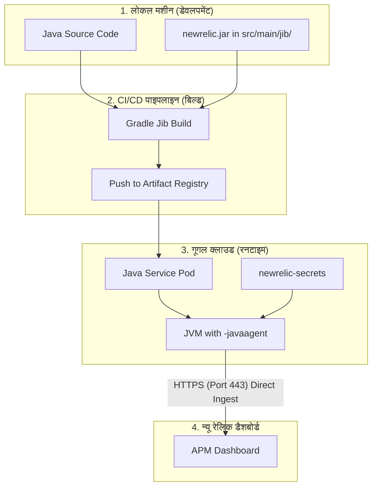
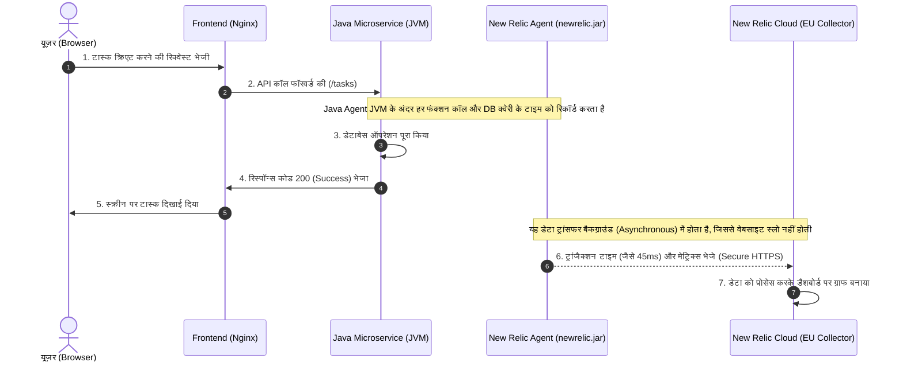
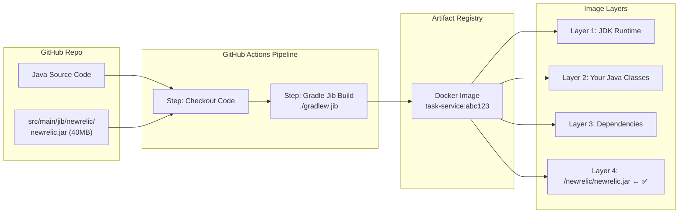

# New Relic Java APM Setup & Architecture Guide

यह गाइड आपको विस्तार से समझाएगी कि हमने माइक्रोसर्विसेज (`task-service` और `quote-service`) के लिए **New Relic Java APM** का सेटअप कैसे किया, इसके पीछे का आर्किटेक्चर क्या है, और डेटा फ्लो कैसे काम करता है।

---

## 1. कोर कांसेप्ट: Java Agent क्या है?

Java में किसी एप्लीकेशन को मॉनिटर करने के लिए New Relic एक **Java Agent (`newrelic.jar`)** का उपयोग करता है।
* यह एजेंट एप्लीकेशन के चलने से पहले **JVM (Java Virtual Machine)** में लोड होता है।
* इसके लिए JVM को एक विशेष फ्लैग दिया जाता है: `-javaagent:/path/to/newrelic.jar`।
* जब आपका कोड चलता है, तो यह एजेंट बैकग्राउंड में कोड के परफॉरमेंस (API response time, database query time, errors) को ट्रैक करता है और उसे न्यू रेलिक के क्लाउड सर्वर पर भेजता है।

---

## 2. हमने एप्रोच क्यों बदली? (Transition of Approach)

शुरुआत में हमने जो सेटअप किया था और जो अंत में फाइनल हुआ, उनके बीच का अंतर समझना बहुत ज़रूरी है:

### एप्रोच A: रनटाइम डाउनलोड (जो फेल हो गई ❌)
हम कंटेनर के अंदर एक `initContainer` (Busybox) चलाकर इंटरनेट (`download.newrelic.com`) से जार फ़ाइल डाउनलोड कर रहे थे।
* **दिक्कत:** **GKE Autopilot** सिक्योरिटी कारणों से पॉड्स (Pods) को सीधे इंटरनेट एक्सेस नहीं देता (जब तक Cloud NAT कॉन्फ़िगर न हो)। इस वजह से डाउनलोड फेल हो गया (`Connection reset by peer`) और पॉड्स क्रैश हो गए।

### एप्रोच B: प्री-बेक्ड इमेज / Jib एम्बेडिंग (जो सफल रही ✅)
हमने जार फ़ाइल को इंटरनेट से डाउनलोड करने के बजाय सीधे इमेज का हिस्सा बना दिया।
* **समाधान:** हमने `newrelic.jar` को लोकल कंप्यूटर पर डाउनलोड करके कोड के अंदर `src/main/jib/newrelic/` फ़ोल्डर में रख दिया। 
* जब गिटहब पाइपलाइन चली, तो उसने जार फ़ाइल को इमेज के अंदर ही पैक (bake) कर दिया। रनटाइम पर कोई डाउनलोडिंग नहीं हुई!

---

## 3. डेटा फ्लो आर्किटेक्चर (Data Flow Diagram)

यह फ्लोचार्ट दिखाता है कि डेवलपमेंट से लेकर क्लाउड मॉनिटरिंग तक कोड और डेटा कैसे ट्रैवल करता है:



---

## 4. रियल-टाइम ट्रांजैक्शन फ्लो (Sequence Diagram)

जब कोई यूज़र वेबसाइट पर जाकर कोई एक्शन करता है (जैसे टास्क क्रिएट करना), तो परफॉरमेंस डेटा न्यू रेलिक तक कैसे पहुँचता है:



---

## 4. Jib से Container में Jar कैसे पहुँची? (Deep Dive)

यह सबसे महत्वपूर्ण हिस्सा है। यहाँ एक-एक स्टेप विस्तार से समझाते हैं:

### Step A: Jib क्या है और यह Docker से अलग कैसे है?

| | **Docker** | **Jib** |
|---|---|---|
| Docker daemon चाहिए? | ✅ हाँ | ❌ नहीं |
| Dockerfile चाहिए? | ✅ हाँ | ❌ नहीं |
| Build कहाँ होती है? | लोकल मशीन पर | सीधे रजिस्ट्री में |
| Extra files कैसे जोड़ें? | `COPY` command | `src/main/jib/` फोल्डर |

> [!NOTE]
> Jib एक Gradle/Maven plugin है जो बिना Docker के सीधे Java एप्लीकेशन की Docker Image बनाता है। यह Image को Artifact Registry में directly push करता है।

---

### Step B: `src/main/jib/` फोल्डर का जादू

Jib का एक बहुत खास नियम है:

> **"`src/main/jib/` के अंदर रखी हर फ़ाइल और फोल्डर, container की `/` (root) डायरेक्टरी में exactly उसी स्ट्रक्चर में copy हो जाती है।"**

इसे एक उदाहरण से समझें:

```
आपकी लोकल फ़ाइल:                    Container के अंदर:
─────────────────────────────────    ──────────────────────
task-service/
  src/
    main/
      jib/                    ──▶    /
        newrelic/             ──▶      newrelic/
          newrelic.jar        ──▶        newrelic.jar  ✅
```

**मतलब:** हमने जो jar `task-service/src/main/jib/newrelic/newrelic.jar` पर रखी,
वह Container के अंदर `/newrelic/newrelic.jar` पर पहुँच गई — **बिना किसी Dockerfile के!**

---

### Step C: हमने यह फाइल बनाई कैसे? (Actual Commands)

हमने 2 काम किए:

**1. Jar File डाउनलोड करके सही जगह रखी:**
```powershell
# दोनों सर्विसेज के लिए फोल्डर बनाए
New-Item -ItemType Directory -Force task-service/src/main/jib/newrelic
New-Item -ItemType Directory -Force quote-service/src/main/jib/newrelic

# New Relic की official website से jar डाउनलोड की (40MB)
Invoke-WebRequest \
  -Uri "https://download.newrelic.com/newrelic/java-agent/newrelic-agent/current/newrelic.jar" \
  -OutFile "task-service/src/main/jib/newrelic/newrelic.jar"

# Quote Service के लिए copy की
Copy-Item "task-service/src/main/jib/newrelic/newrelic.jar" \
           "quote-service/src/main/jib/newrelic/newrelic.jar"
```

**2. `.gitignore` में Whitelist किया:**
गिट डिफ़ॉल्ट रूप से सभी `*.jar` फाइलें ignore करता है। इसलिए हमने exception जोड़ी:
```
# .gitignore में:
*.jar
!**/newrelic.jar     ← यह लाइन जोड़ी ताकि newrelic.jar push हो सके
!**/gradle-wrapper.jar
```

**3. Commit `aea8dbc` में क्या push हुआ:**
```
commit aea8dbc
├── create mode: quote-service/src/main/jib/newrelic/newrelic.jar  (40MB)
├── create mode: task-service/src/main/jib/newrelic/newrelic.jar   (40MB)
├── modify: .gitignore                  (newrelic.jar whitelist)
├── modify: helm/.../task-service.yaml  (env vars जोड़े)
└── modify: helm/.../quote-service.yaml (env vars जोड़े)
```

---

### Step D: Container Build का पूरा फ्लो



---

### Step E: JVM Agent कैसे activate होता है?

Container स्टार्ट होने पर GKE यह command चलाता है:

```bash
# JVM इस command से start होती है (JAVA_TOOL_OPTIONS env var की वजह से):
java -javaagent:/newrelic/newrelic.jar \
     -jar /app/task-service.jar
#    ↑ यह newrelic.jar container में Layer 4 में मौजूद है!
```

**`JAVA_TOOL_OPTIONS` env var Kubernetes YAML में:**
```yaml
env:
  - name: JAVA_TOOL_OPTIONS
    value: "-javaagent:/newrelic/newrelic.jar"  # ← Jar path container में
  - name: NEW_RELIC_APP_NAME
    value: "task-service"                       # ← Dashboard पर दिखने वाला नाम
  - name: NEW_RELIC_LICENSE_KEY
    valueFrom:
      secretKeyRef:
        name: newrelic-secrets                  # ← Kubernetes Secret से
        key: license-key
```

> [!IMPORTANT]
> `JAVA_TOOL_OPTIONS` एक standard Java environment variable है। कोई भी JVM इसे automatically पढ़ता है और इसमें दिए गए flags को JVM startup पर apply करता है। इसीलिए हमें application code में कोई बदलाव नहीं करना पड़ा!

---

## 5. न्यू रेलिक इनेबल करने के 4 आसान स्टेप्स (Action Plan)

भविष्य में जब भी आपको किसी नई जावा सर्विस में न्यू रेलिक जोड़ना हो, तो केवल ये 4 स्टेप्स करने होंगे:

### स्टेप 1: जार फ़ाइल रखें (Embed Jar)
अपनी जावा सर्विस के प्रोजेक्ट फोल्डर में जाएं और यह फोल्डर स्ट्रक्चर बनाकर एजेंट रख दें:
`[your-service-name]/src/main/jib/newrelic/newrelic.jar`
> [!NOTE]
> Jib टूल का यह नियम है कि `src/main/jib/` के अंदर रखी हर फ़ाइल को वह कंटेनर इमेज की रूट `/` डायरेक्टरी में हूबहू कॉपी कर देता है। इसलिए जार फ़ाइल इमेज में `/newrelic/newrelic.jar` पर मिलेगी।

### स्टेप 2: `.gitignore` में अपवाद जोड़ें
गिटहब पर कोड पुश करते समय जार फ़ाइल ब्लॉक न हो, इसके लिए `.gitignore` में यह लाइन जोड़ें:
```text
!**/newrelic.jar
```

### स्टेप 3: Kubernetes Deployment YAML में कॉन्फ़िगरेशन करें
अपने हेल्म चार्ट या कुबेरनेटीस YAML में कंटेनर के अंदर केवल 3 एन्वायरमेंट वैरिएबल जोड़ें:
```yaml
env:
  # 1. JVM को बताएं कि एजेंट कहाँ है
  - name: JAVA_TOOL_OPTIONS
    value: "-javaagent:/newrelic/newrelic.jar"
  # 2. न्यू रेलिक डैशबोर्ड पर दिखने वाला नाम
  - name: NEW_RELIC_APP_NAME
    value: "your-service-name"
  # 3. न्यू रेलिक की सीक्रेट लाइसेंस की
  - name: NEW_RELIC_LICENSE_KEY
    valueFrom:
      secretKeyRef:
        name: newrelic-secrets
        key: license-key
```

### स्टेप 4: Helm Values में License Key पास करें
डिप्लॉय करते समय केवल `NEW_RELIC_LICENSE_KEY` सीक्रेट को क्लस्टर में क्रिएट करें:
```bash
helm upgrade --install java-app ./helm/java-app \
  --set newrelic.licenseKey="your-license-key"
```

---

## 6. मुख्य बातें जो आपको हमेशा याद रखनी हैं

> [!IMPORTANT]
> **1. कोई क्लस्टर एजेंट (nri-bundle) आवश्यक नहीं:** GKE Autopilot पर हमें कोई हेल्म चार्ट या क्लस्टर-लेवल न्यू रेलिक एजेंट इंस्टॉल करने की ज़रूरत नहीं है। हमारी जावा माइक्रोसर्विसेज खुद सीधे न्यू रेलिक क्लाउड को अपना डेटा भेजती हैं।
> 
> **2. यूरोपियन यूनियन (EU) रीजन:** चूँकि आपका लाइसेंस की `eu01` से शुरू होता है, इसलिए न्यू रेलिक एजेंट समझ जाता है कि डेटा को यूरोप के डेटा सेंटर में भेजना है। आपको इसके लिए अलग से कोई यूआरएल सेट नहीं करना पड़ता।
