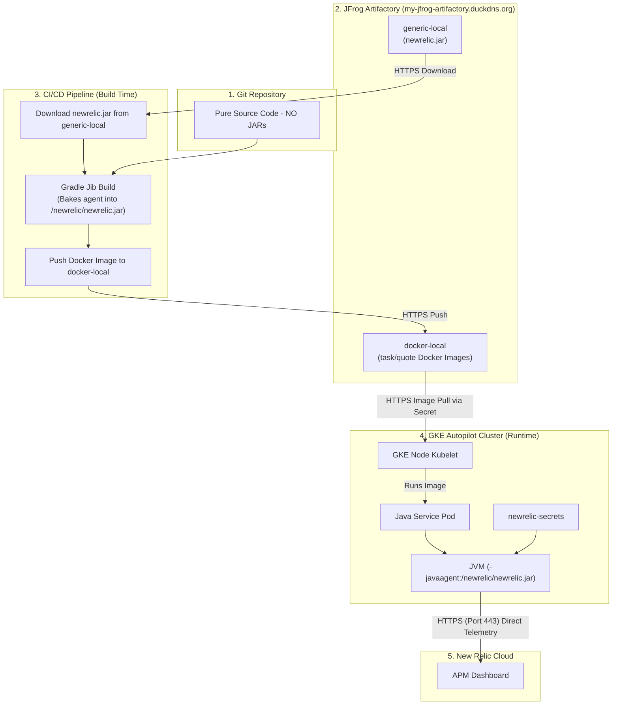

# New Relic Java APM Setup & Architecture Guide (Artifactory Edition)

यह गाइड आपको विस्तार से समझाएगी कि हमने माइक्रोसर्विसेज (`task-service` और `quote-service`) के लिए **New Relic Java APM** का सेटअप **JFrog Artifactory** और **Jib Layering** का उपयोग करके कैसे किया।

---

## 1. कोर कांसेप्ट: Java Agent क्या है?

Java में किसी एप्लीकेशन को मॉनिटर करने के लिए New Relic एक **Java Agent (`newrelic.jar`)** का उपयोग करता है।
* यह एजेंट एप्लीकेशन के चलने से पहले **JVM (Java Virtual Machine)** में लोड होता है।
* इसके लिए JVM को एक विशेष फ्लैग दिया जाता है: `-javaagent:/newrelic/newrelic.jar`।
* जब आपका कोड चलता है, तो यह एजेंट बैकग्राउंड में कोड के परफॉरमेंस (API response time, database query time, errors) को ट्रैक करता है और उसे न्यू रेलिक के क्लाउड सर्वर पर भेजता है।

---

## 2. आर्किटेक्चर इवोल्यूशन (Approach Evolution)

हमने न्यू रेलिक एजेंट को मैनेज करने के लिए 3 अलग-अलग अप्रोच आजमाईं:

```
[अप्रोच A: रनटाइम डाउनलोड (फेल ❌)] ➔ [अप्रोच B: Git में Jar रखना (अमान्य ❌)] ➔ [अप्रोच C: Artifactory + Jib (सफल ✅)]
```

### ❌ अप्रोच A: Pod में initContainer से डाउनलोड करना (फेल)
* **क्या किया:** पॉड स्टार्ट होते समय `busybox` + `wget` से इंटरनेट से जार डाउनलोड करने की कोशिश की।
* **फेल होने का कारण:** GKE Autopilot सुरक्षा कारणों से रनटाइम पर आउटबाउंड इंटरनेट एक्सेस ब्लॉक कर देता है (`Connection reset by peer`)।

### ❌ अप्रोच B: Git रिपॉजिटरी में 40MB की Jar कमिट करना (अमान्य)
* **क्या किया:** जार फ़ाइल को लोकल कंप्यूटर पर डाउनलोड करके सीधे Git में कमिट कर दिया।
* **अमान्य क्यों:** यह Enterprise मानकों के खिलाफ है। 40MB की बाइनरी फाइलों से Git रिपॉजिटरी भारी और स्लो हो जाती है।

### ✅ अप्रोच C: Artifactory + CI/CD Build Time Fetching (अंतिम और सफल)
* **क्या किया:** 
  1. `newrelic.jar` को हमारे स्व-होस्टेड **JFrog Artifactory (`generic-local`)** में स्टोर किया गया।
  2. CI/CD बिल्ड के समय GitHub Actions Runner (जिसके पास इंटरनेट है) Artifactory से जार डाउनलोड करता है।
  3. **Gradle Jib** बिल्ड टूल उस जार को Docker Image की लेयर में ही पैक (`/newrelic/newrelic.jar`) कर देता है।
  4. जब Pod GKE में स्टार्ट होता है, तो एजेंट पहले से इमेज के अंदर मौजूद होता है — **रनटाइम पर 0 इंटरनेट की ज़रूरत!**

---

## 3. डेटा फ्लो आर्किटेक्चर (Data Flow Diagram)



---

## 4. Jib से Container में Jar कैसे पहुँची? (Deep Dive)

Jib का एक बहुत खास नियम है:

> **"`src/main/jib/` के अंदर रखी हर फ़ाइल और फोल्डर, container की `/` (root) डायरेक्टरी में exactly उसी स्ट्रक्चर में copy हो जाती है।"**

### CI/CD बिल्ड टाइम पर फ़ाइल मैपिंग:

```
GitHub Actions Runner पर:             Container के अंदर:
─────────────────────────────────    ──────────────────────
task-service/
  src/
    main/
      jib/                    ──▶    /
        newrelic/             ──▶      newrelic/
          newrelic.jar        ──▶        newrelic.jar  ✅
```

### GitHub Actions (`deploy.yml`) में स्वचालित स्टेप:
```yaml
- name: Fetch New Relic Agent from Artifactory
  run: |
    mkdir -p task-service/src/main/jib/newrelic
    mkdir -p quote-service/src/main/jib/newrelic
    
    # Artifactory generic-local से जार फ़ाइल डाउनलोड करें
    curl -s -u "${{ secrets.ARTIFACTORY_USER }}:${{ secrets.ARTIFACTORY_GENERIC_TOKEN }}" \
      -o task-service/src/main/jib/newrelic/newrelic.jar \
      "https://my-jfrog-artifactory.duckdns.org/artifactory/generic-local/newrelic/newrelic.jar"
    
    cp task-service/src/main/jib/newrelic/newrelic.jar quote-service/src/main/jib/newrelic/newrelic.jar
```

---

## 5. JVM Agent कैसे activate होता है?

Container स्टार्ट होने पर GKE Kubernetes Deployment Manifests द्वारा यह एन्वायरमेंट वैरिएबल पास करता है:

### `JAVA_TOOL_OPTIONS` Kubernetes YAML में:
```yaml
env:
  # 1. JVM को बताएं कि एजेंट इमेज में कहाँ है
  - name: JAVA_TOOL_OPTIONS
    value: "-javaagent:/newrelic/newrelic.jar"
  # 2. न्यू रेलिक डैशबोर्ड पर दिखने वाला नाम
  - name: NEW_RELIC_APP_NAME
    value: "task-service"
  # 3. न्यू रेलिक की सीक्रेट लाइसेंस की
  - name: NEW_RELIC_LICENSE_KEY
    valueFrom:
      secretKeyRef:
        name: newrelic-secrets
        key: license-key
```

> [!IMPORTANT]
> `JAVA_TOOL_OPTIONS` एक मानक (Standard) Java environment variable है। कोई भी JVM इसे अपने आप पढ़ता है और इसमें दिए गए फ़्लैग्स को JVM स्टार्टअप पर लागू कर देता है। इसीलिए हमें अपने एप्लीकेशन कोड (`.java` फ़ाइलों) में कोई बदलाव नहीं करना पड़ा!

---

## 6. मुख्य निष्कर्ष (Key Summary)

1. **Git बाइनरी मुक्त है:** Git रिपॉजिटरी में कोई भी `.jar` फ़ाइल स्टोर नहीं है।
2. **Artifactory सेंट्रल सोर्स है:** एजेंट आर्टिफैक्ट्री `generic-local` में सुरक्षित है और बिल्ड टाइम पर पुल होता है।
3. **GKE Autopilot सपोर्ट:** पॉड्स बिना किसी नेटवर्क एरर के तुरंत स्टार्ट होते हैं क्योंकि जार इमेज की लेयर का हिस्सा होती है।
