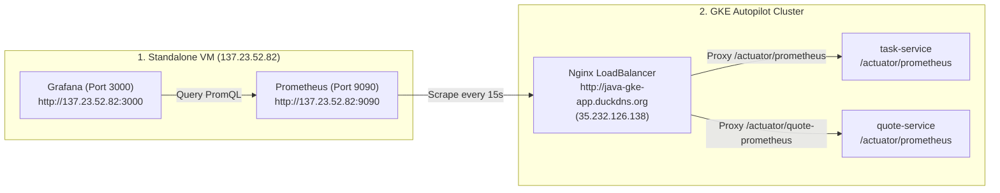

# Prometheus & Grafana Standalone VM Integration Guide

This guide explains how to connect your standalone **Prometheus (`http://137.23.52.82:9090/`)** and **Grafana (`http://137.23.52.82:3000/`)** instance running on your VM to monitor the GKE Spring Boot microservices and cluster workloads.

---

## 1. Codebase & Endpoint Architecture

The application microservices (`task-service` and `quote-service`) expose standard **Prometheus Metrics** via Spring Boot Actuator and Micrometer.



---

## 2. Configuration for Your VM (`137.23.52.82`)

### A. Update `prometheus.yml` on your VM (`137.23.52.82`)

Add the following `scrape_configs` to your VM's `prometheus.yml` file:

```yaml
global:
  scrape_interval: 15s

scrape_configs:
  # Job 1: Scrape Task Service Metrics via GKE Static IP / Domain
  - job_name: 'gke-task-service'
    metrics_path: '/actuator/prometheus'
    static_configs:
      - targets: ['java-gke-app.duckdns.org:80']  # or 35.232.126.138:80

  # Job 2: Scrape Quote Service Metrics via GKE Static IP / Domain
  - job_name: 'gke-quote-service'
    metrics_path: '/actuator/quote-prometheus'
    static_configs:
      - targets: ['java-gke-app.duckdns.org:80']  # or 35.232.126.138:80
```

Restart your Prometheus container on the VM:
```bash
docker restart prometheus
```

---

## 3. Configuring Grafana (`http://137.23.52.82:3000/`)

### Step 1: Add Prometheus Data Source
1. Open **`http://137.23.52.82:3000/`** in your browser.
2. Go to **Connections ➔ Data Sources ➔ Add Data Source**.
3. Select **Prometheus**.
4. Set URL to: `http://137.23.52.82:9090` (or `http://localhost:9090` if running in docker network).
5. Click **Save & Test**.

### Step 2: Import Pre-built Spring Boot Dashboards
Grafana has official pre-configured dashboards for JVM & Spring Boot metrics:
1. In Grafana, click **Dashboards ➔ New ➔ Import**.
2. Enter Dashboard ID: **`11378`** (JVM & Spring Boot Statistics) or **`4701`** (JVM Micrometer).
3. Click **Load**, select your Prometheus Data Source, and click **Import**.

---

## 4. Live Metrics Exposed

Once deployed, you can verify raw Prometheus metrics directly from your browser:
* **Task Service Metrics:** `http://java-gke-app.duckdns.org/actuator/prometheus`
* **Quote Service Metrics:** `http://java-gke-app.duckdns.org/actuator/quote-prometheus`
