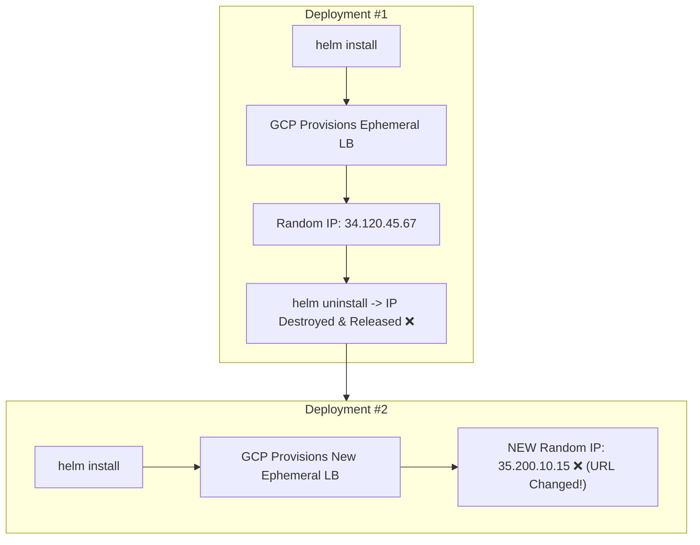
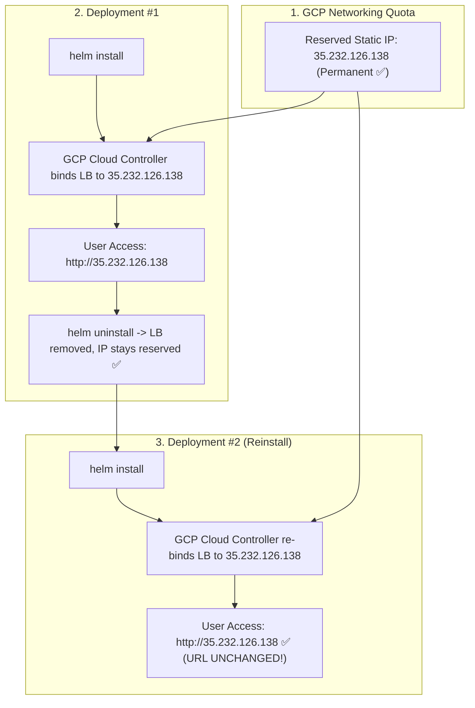
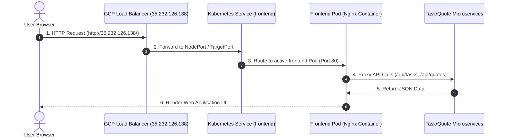

# Kubernetes Static IP Binding Architecture Guide

This document explains how **Static IP Reservation** works in Kubernetes (`type: LoadBalancer`) on **Google Kubernetes Engine (GKE)**, comparing dynamic ephemeral IP allocation with static IP binding.

---

## 1. Dynamic IP Allocation (Before) vs Static IP Binding (Now)

### Scenario A: Ephemeral Dynamic IP (Default Behavior)
When `frontend.yaml` specifies `type: LoadBalancer` without a `loadBalancerIP` field:
1. GKE Cloud Controller requests an **Ephemeral (Temporary) IP** from GCP's shared IP pool.
2. GCP provisions a Network Load Balancer and attaches a randomly assigned IP (e.g., `34.120.45.67`).
3. **The Problem:** When you run `helm uninstall java-app`, Kubernetes destroys the Load Balancer and returns the IP to GCP's pool. Upon the next `helm install`, GCP assigns a **brand new IP** (e.g., `35.200.10.15`), breaking your bookmarks, DNS records, and frontend client URLs.



---

### Scenario B: Reserved Static IP Binding (Current Architecture)
By executing `gcloud compute addresses create frontend-static-ip --region us-central1`, we reserved `35.232.126.138` permanently in your GCP networking quota.

When `frontend.yaml` specifies `spec.loadBalancerIP: "35.232.126.138"`:
1. GKE Cloud Controller checks GCP Networking for the pre-reserved address `35.232.126.138`.
2. GCP binds the newly created Load Balancer directly to your reserved IP address.
3. **The Advantage:** When you run `helm uninstall java-app`, the Load Balancer is removed, but the IP `35.232.126.138` **remains safely reserved in your GCP account**. When you reinstall, GCP re-binds the Load Balancer to the **exact same IP address**.



---

## 2. Technical Implementation Details

### A. Kubernetes Manifest (`frontend.yaml`)
```yaml
apiVersion: v1
kind: Service
metadata:
  name: frontend
spec:
  type: LoadBalancer
  {{- if .Values.frontend.loadBalancerIP }}
  loadBalancerIP: {{ .Values.frontend.loadBalancerIP | quote }}
  {{- end }}
  ports:
    - port: 80
      targetPort: 80
  selector:
    app: frontend
```

### B. Helm Parameters (`values.yaml` & CI/CD Pipeline)
- **`values.yaml`**: Defines default `frontend.loadBalancerIP: ""`
- **GitHub Actions (`deploy.yml`)**: Dynamically injects the secret value into Helm execution:
  ```bash
  helm upgrade --install java-app ./helm/java-app \
    --set frontend.loadBalancerIP="${{ secrets.FRONTEND_STATIC_IP }}"
  ```

---

## 3. Request Routing Sequence



---

## 4. Key Takeaways
1. **Zero Downtime Re-bindings:** Re-deploying or restarting your cluster workloads will never change your public endpoint.
2. **DNS & Custom Domain Ready:** You can map any custom domain (e.g., `my-app.com` or `my-app.duckdns.org`) to `35.232.126.138` via an A-record once and never update it again.
3. **Cost Efficiency:** Regional static IP addresses in GCP are free when actively attached to a running Load Balancer.
