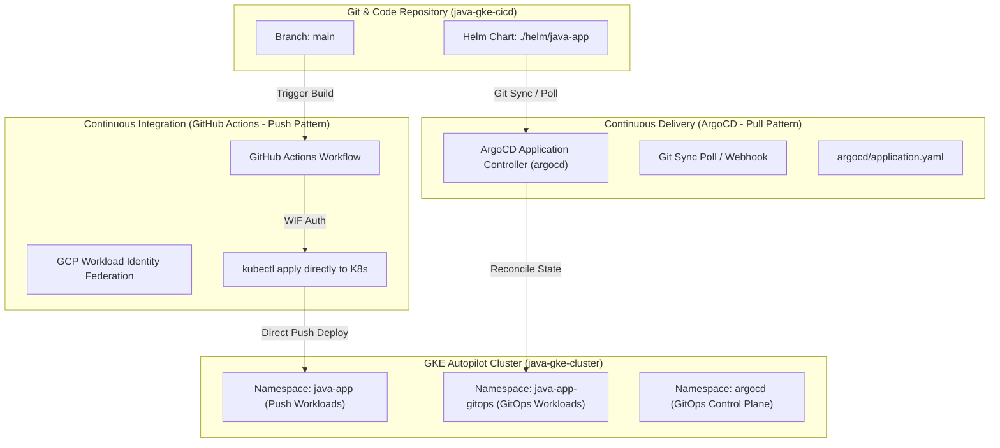

# GitOps Implementation Guide: ArgoCD Pull-Based Pattern on GKE Autopilot

## Executive Summary & Architecture

This guide details the implementation of **ArgoCD GitOps (Pull Pattern)** operating alongside an existing **GitHub Actions (Push Pattern)** CI/CD pipeline on the same GKE Autopilot cluster (`java-gke-cluster`) within GCP Project `project-616fef18-15b8-4d6c-8a2`.



---

## 1. Architectural Comparison: Push vs. Pull Pattern

| Architectural Dimension | Push Pattern (GitHub Actions) | Pull Pattern (ArgoCD GitOps) |
| :--- | :--- | :--- |
| **Execution Trigger** | External runner executes `kubectl apply` via CI pipeline. | In-cluster operator polls Git repository and pulls state. |
| **K8s Credentials** | Service Account / WIF keys exported to GitHub Secrets. | Zero cluster credentials exported; ArgoCD runs inside cluster. |
| **Drift Correction** | Manual or next CI trigger. | Continuous automated reconciliation (`selfHeal: true`). |
| **Security Surface** | Inbound API server exposure required for external CI. | Cluster API remains private; outbound HTTPS polling to Git. |
| **Target Namespace** | `java-app` | `java-app-gitops` (Namespace Isolated) |

---

## 2. Zero-Disruption Guarantee (Namespace Isolation)

To ensure **100% zero disruption** to the existing GitHub Actions push pipeline:
1. **Isolated Namespaces**:
   - Push deployments target `java-app` (or existing default namespace).
   - GitOps deployments target `java-app-gitops`.
2. **Dedicated Helm Values**:
   - `values.yaml`: Used for push deployments.
   - `values-gitops.yaml`: Overrides used strictly by ArgoCD for the GitOps namespace.
3. **No Network / Routing Collisions**:
   - Services and deployments have unique selector scoping per namespace.
   - Ingress endpoints are explicitly separated.

---

## 3. ArgoCD Installation on GKE Autopilot

GKE Autopilot enforces strict security and resource management:
- No root user execution without explicit securityContext.
- Resource limits must meet minimum Autopilot thresholds.
- ArgoCD official manifests are fully compatible with GKE Autopilot.

### Quick Installation Steps:

#### Option A: Using PowerShell (Windows)
```powershell
.\argocd\install-argocd.ps1
```

#### Option B: Using Bash (Linux/macOS)
```bash
chmod +x ./argocd/install-argocd.sh
./argocd/install-argocd.sh
```

#### Option C: Manual kubectl Commands
```bash
# 1. Connect to cluster
gcloud container clusters get-credentials java-gke-cluster --region us-central1 --project project-616fef18-15b8-4d6c-8a2

# 2. Create namespaces
kubectl apply -f argocd/namespace.yaml

# 3. Apply ArgoCD standard manifest
kubectl apply -n argocd -f https://raw.githubusercontent.com/argoproj/argo-cd/stable/manifests/install.yaml

# 4. Wait for controller deployment
kubectl rollout status deployment/argocd-server -n argocd --timeout=300s

# 5. Apply ArgoCD Application CRD
kubectl apply -f argocd/application.yaml
```

---

## 4. Accessing the ArgoCD Dashboard / UI

### 1. Retrieve Admin Password
ArgoCD generates an initial admin secret upon deployment.

```bash
# Linux/macOS
kubectl -n argocd get secret argocd-initial-admin-secret -o jsonpath="{.data.password}" | base64 --decode; echo

# Windows PowerShell
[System.Text.Encoding]::UTF8.GetString([System.Convert]::FromBase64String((kubectl -n argocd get secret argocd-initial-admin-secret -o jsonpath="{.data.password}")))
```

### 2. Establish Secure Tunnel (Port Forwarding)
```bash
kubectl port-forward svc/argocd-server -n argocd 8080:443
```

- **URL**: `https://localhost:8080`
- **Username**: `admin`
- **Password**: *(Retrieved in step 1)*

---

## 5. ArgoCD Application Specification (`argocd/application.yaml`)

```yaml
apiVersion: argoproj.io/v1alpha1
kind: Application
metadata:
  name: java-app-gitops
  namespace: argocd
  finalizers:
    - resources-finalizer.argocd.argoproj.io
spec:
  project: default
  source:
    repoURL: 'https://github.com/amitpandey1992/java-gke-cicd'
    targetRevision: main
    path: helm/java-app
    helm:
      valueFiles:
        - values-gitops.yaml
  destination:
    server: 'https://kubernetes.default.svc'
    namespace: java-app-gitops
  syncPolicy:
    automated:
      prune: true
      selfHeal: true
    syncOptions:
      - CreateNamespace=true
      - ApplyOutOfSyncOnly=true
    retry:
      limit: 5
      backoff:
        duration: 5s
        factor: 2
        maxDuration: 3m
```

---

## 6. Operational Verification & Testing

### Verification Checklist

1. **Verify ArgoCD Controller Health**:
   ```bash
   kubectl get pods -n argocd
   ```
   *Expected: `argocd-server`, `argocd-repo-server`, `argocd-application-controller` are all `Running`.*

2. **Verify Application Sync Status**:
   ```bash
   kubectl get application -n argocd
   ```
   *Expected: `SYNC STATUS` = `Synced`, `HEALTH STATUS` = `Healthy`.*

3. **Verify GitOps Namespace Deployment**:
   ```bash
   kubectl get all -n java-app-gitops
   ```
   *Expected: `task-service`, `quote-service`, `nginx-frontend`, and `postgres-service` pods are running.*

4. **Test Self-Healing (Drift Correction)**:
   ```bash
   # Delete a deployment manually in the GitOps namespace
   kubectl delete deployment task-service -n java-app-gitops
   
   # Check pod status after 10-15 seconds
   kubectl get pods -n java-app-gitops
   ```
   *Result: ArgoCD automatically detects drift and recreates the `task-service` deployment from Git source.*

5. **Verify Zero Disruption to Push Pipeline**:
   ```bash
   kubectl get all -n java-app
   ```
   *Result: Existing push-based workloads remain unaltered and unaffected.*
