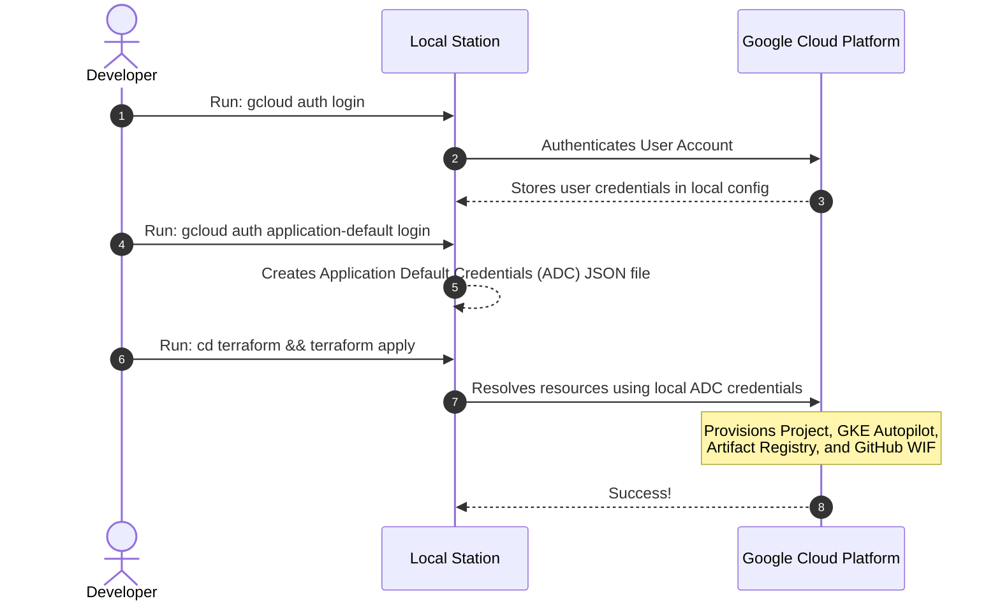
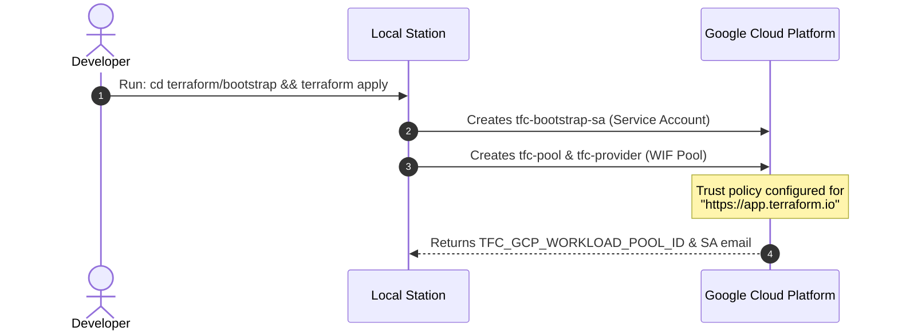
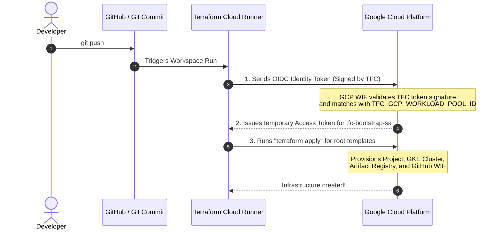

# 🗺️ Terraform Bootstrap & Execution Workflows

This guide visualizes the differences between running Terraform locally on your workstation versus automating it using Terraform Cloud (TFC) with keyless Workload Identity Federation (WIF).

---

## 💻 Workflow 1: Running Root Terraform Locally

If you just run Terraform directly from your terminal, the bootstrap folder is **not used**.



---

## ☁️ Workflow 2: Running Root Terraform on Terraform Cloud

If you want to use **Terraform Cloud** to run the root `terraform/` templates automatically, you must run the **bootstrap** configuration once locally first.

### Phase A: Setup the Bootstrap (Once from Local Station)
We create a bridge (trust association) between GCP and Terraform Cloud.



### Phase B: Configure TFC Variables (Once in Terraform Cloud Console)
You copy the output values from Phase A and save them in your Terraform Cloud Workspace settings.

```
[Terraform Cloud Workspace Variables]
 ├── TFC_GCP_WORKLOAD_POOL_ID = "projects/12345/locations/global/workloadIdentityPools/tfc-pool/providers/tfc-provider"
 └── TFC_GCP_RUN_SERVICE_ACCOUNT_EMAIL = "tfc-bootstrap-sa@project-id.iam.gserviceaccount.com"
```

### Phase C: Automated Execution (Runs on Git Push)
Whenever you push changes to your root `terraform/` infrastructure code, Terraform Cloud runs it automatically without any passwords.


